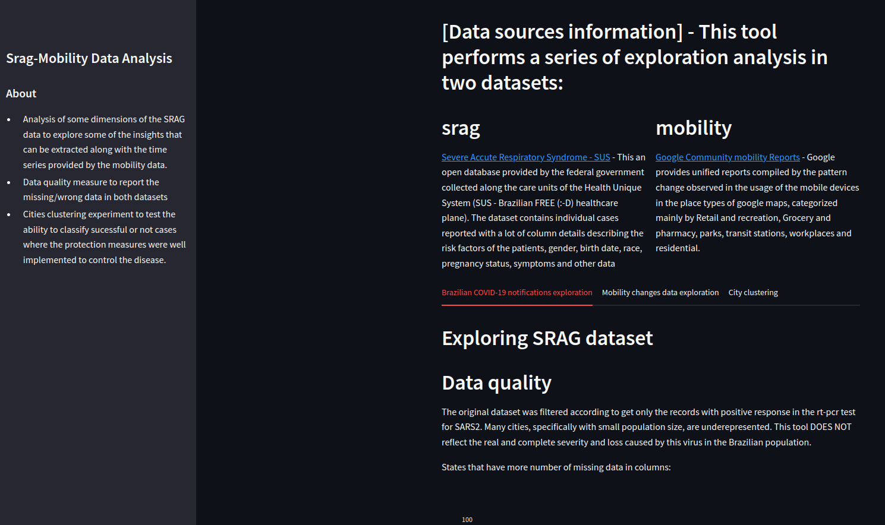

# SurvInTime - Surveillance methods and Dashboard for analysis of Severe Acute Respiratory Syndrome (srag) dataset and Google's community mobility change (mobility) in Streamlit

## Summary
This tool performs a series of exploration analysis in the two datasets about covid-19 that were released along the pandemic: 
- Exploration of data quality in the srag dataset such as missing data across the distinct brazilian states.
- Distribution of outcomes along the cities of a specific state, with a visualization projected in the state map. 
- Many possibilities of filters with visualizations varying the orientation such as along periods of time or in relation to the top 15 ranked cities. These visualizations explore risk factors, gender, race, age groups, etc.
- We derived some new columns that were not explored in previous epidemiological studies using this dataset, such as the displacement of people to seek health care, the delay between the person notices the symptoms an the notification, and the delay between the notification and the outcome decision (cure or death).
- We also show a similar analysis of data quality, but in relation to the percentage of cities covered in each state according to the mobility dataset 
- Correlation heatmap among the normalized number of cases and the percentage changes for the six place categories available in google maps, in the brazilian state capitals.
- For each state, we showed a boxplot with a comparison by pair of place categories, fixing residential. This visualization resource aims at showing the chaotic variations intra-state (metrics in the cities of a same state), and inter-state (the overall behavior of the boxplot and quartile locations.
- Ranking of cities according to the residential percentage change together with the overall cases normalized
- City clustering by behavior of the time series built with the cases/deaths/residential change aggregated by week. This analysis aims at showing how discoordinated the efforts to restrain the disease were along the cities, not just because of being a large country but because of the miscommunication that occurred across the government layers.

You can see a live demo [here](https://dashboard-srag-mobility-pipn9w3yh7p.streamlit.app/)

<div style="text-align: center">
	
</div>

## Requirements:
* Python packages needed:
    - pip3 install streamlit
	- pip3 install plotly
	- pip3 install matplotlib
	- pip3 install pandas
	- pip3 install scipy
	- pip3 install numpy
	- pip3 install networkx
	- pip3 install unidecode
	- pip3 install streamlit_agraph

## Usage Instructions
* Preparation:
	1. ````git clone https://github.com/YasCoMa/dashboard-srag-mobility.git````
	2. ````cd dashboard-srag-mobility````
	3. ````streamlit run run.py````
	
## Advanced statistical and machine learning analysis on this data
* Go to the specific instructions in [methods_mlStats_analysis folder](https://github.com/YasCoMa/dashboard-srag-mobility/tree/master/methods_mlStats_analysis)

## Reference
Martins, Y. C., & Francisco Jr, R. D. S. (2023). survInTime - Exploring surveillance methods and data analysis on Brazilian respiratory syndrome dataset and community mobility changes. bioRxiv, 2023-09.
